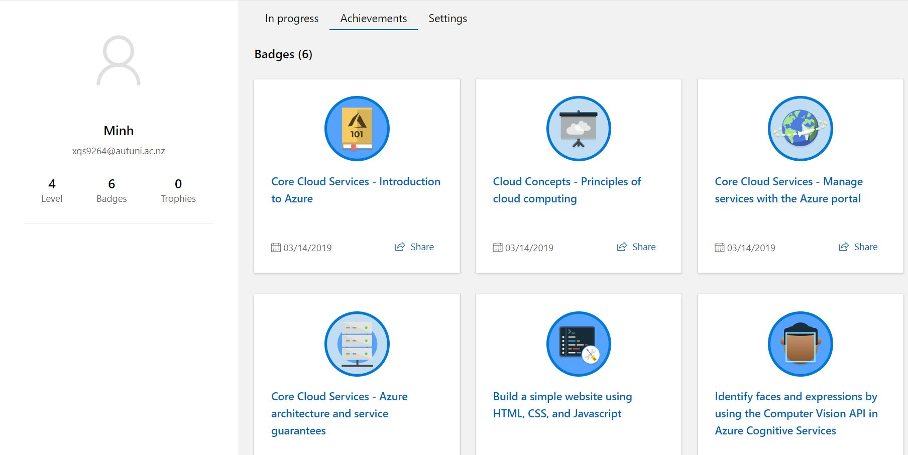

# Are-You-Celeb
Upload an image an see if the image is from  a celeb. Project is a submission to Microsoft Student Accelerator program

### I. How to run it

Grab Azure Vision API key then add an .env file in project directory
In .env file add a field called AZURE_VISION_KEY

### II. Features
* Recognize celebrities
* Recognize human face but will tell that is not a celebs

Not much feature but that's all for now

### III. Screen shot Microsoft learn

